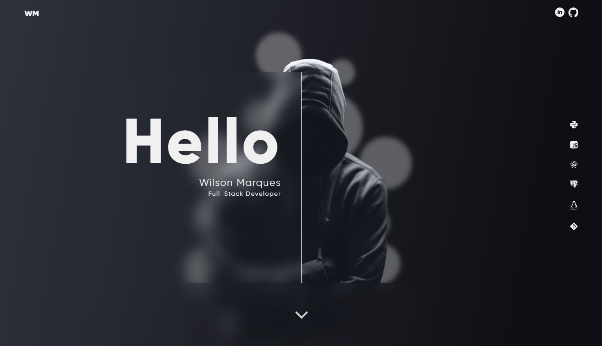
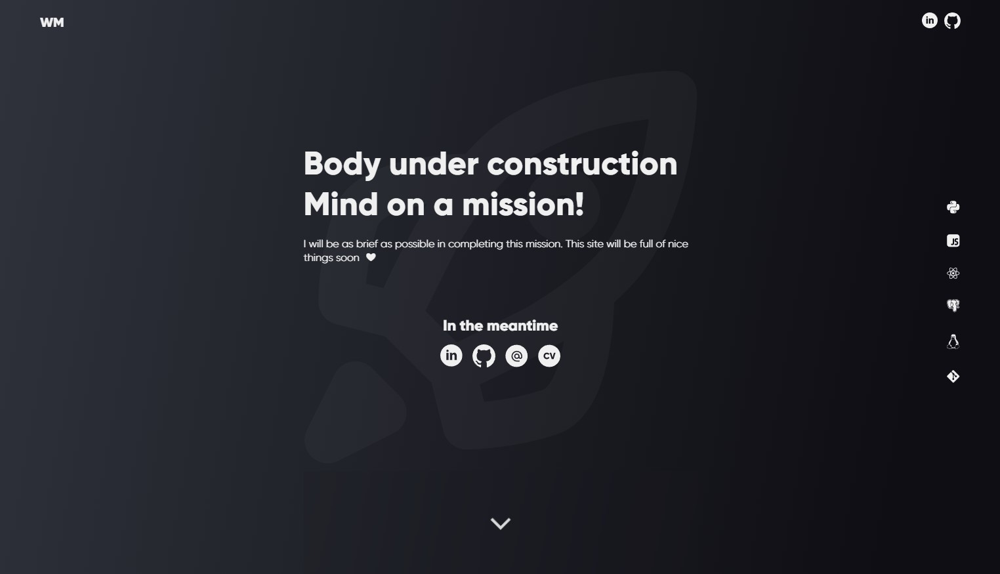
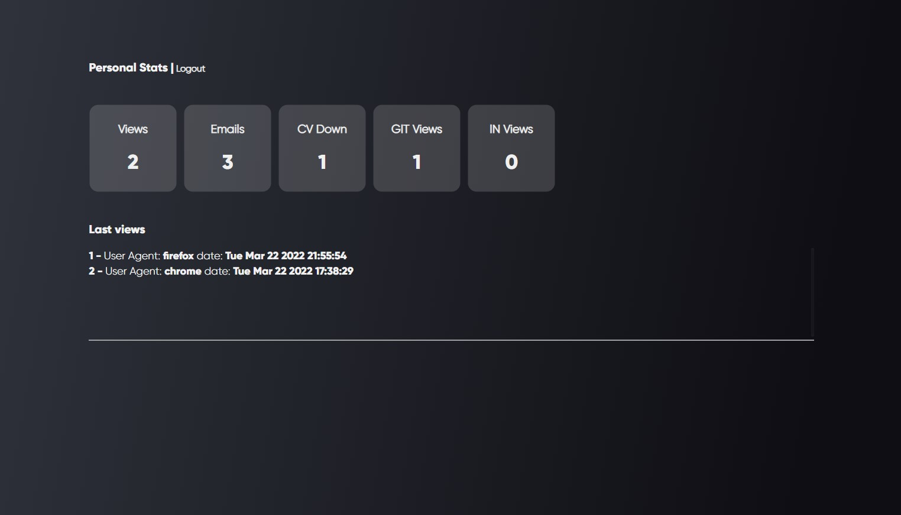

# Personal portfolio
## _Work in progress for my personal portfolio_
 

## Stack used
 - HTML
 - CSS
 - JavaScript
 - NodeJS
 - Express JS
 - PostgreSQL

  

---
 
For the future of this project, I want to create a space to present my works, not only in development, but also in Design and 3D.
Space where I talk more about the project in question. In some cases make a kind of toturials. we will see. 🐵

 

## for now it looks like this:

</img>
</img>

## And a simple "Backoffice" just for some stats
</img>

 

# Thanks! ❤️

